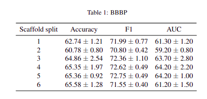
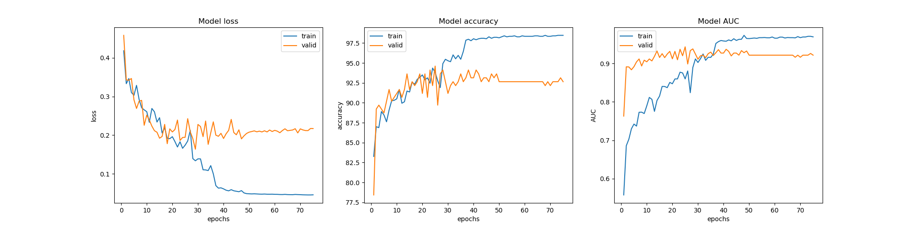
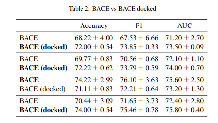
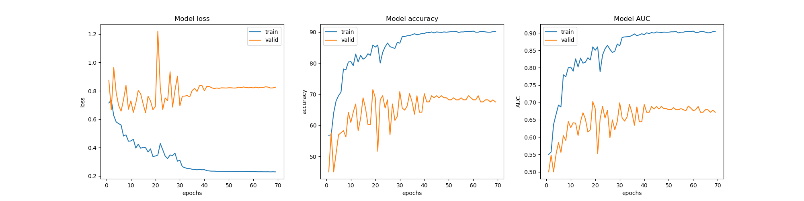
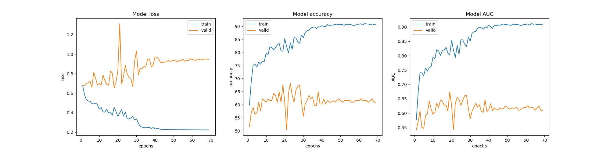

# Bio-Activity Transformer


## Environment Setup

The environment setup steps are shown below:

1. Install [miniconda](https://docs.conda.io/en/latest/miniconda.html) following the instructions for your operating system.
2. Clone this repository
3. Install environment from the YAML file: `conda env create -f environment.yml`

In the `environment-versions.yml` file, the exact versions of each package are listed. They may not be compatible with all operating systems.


## How to run

_Important! If you want to run experiments on docked dataset BACE you should extract positions from file`bace_poses.zip`, to run properly all `.mol2` file should be found under path `data/bace_docked/bace_poses`_

- To reproduce experiments run `./bbbp.sh` or `./bace.sh`
- Or do it manually, run command `python run.py` passing proper parameters:
- Three types of passed parameters:
  - config parameters (gpuid, dataset, mol_files, repeat, exp_name, save_model)
    - This repo contains only BBBP and BACE dataset
    - To run on docked dataset add parameter `--mol_files`
    - `--exp_name test1` means that in `experimets/[dataset_name]/test1` you will find training metrics and evaluation
    - `--repeat 3` number of random repeats
    - if you want to save your model you can add parameter `--save_model`, you will find model under path `experimets/[dataset_name]/test1/repeat_`
  - training hyper-parameters (batch_size, lr, optimizer, epochs, grad_clip, patience)
    - `--grad_clip 1` gradient clipping it's prevent common problem in ML like gradient vanishing/explode 
    - `--patience 50` means that if in 50 epochs AUC won't improve the training will be stopped
  - MAT parameters (d_model, N, h, N_dense, dropout, lambda_attention, lambda_distance, leaky_relu_slope, dense_output_nonlinearity, distance_matrix_kernel, aggregation_type)

#### Example
```
# bace_poses, .mol2
python -u run.py \
       --gpuid 0 --dataset BACE --mol_files --repeat 3 --exp_name default \
       --batch_size 64 --lr 1e-5 --optimizer ADAM --epochs 200 --grad_clip 1 --patience 50 \
       --d_model 1024 --N 8 --h 16 --N_dense 1 --dropout 0.0 \
       --lambda_attention 0.33 --lambda_distance 0.33 --leaky_relu_slope 0.1 \
       --dense_output_nonlinearity relu --distance_matrix_kernel softmax --aggregation_type dummy_node
```

## Results
### BBBP
Average accuracy, F1 score and AUC (%, higher is better) with standard deviation achieved on test dataset over 3 runs in different scaffold splits



Training process




### BACE
Average accuracy, F1 score and AUC (%, higher is better) with standard deviation achieved on test dataset over 3 runs with different MAT settings



As we can see using 3D position base on docking gives better result in almost all MAT settings about 2%, what's more in this results we can observe that we can achieve more stable model because we can see that in case of docked BACE we have lower std than on BACE base on smiles

Training process on docked BACE


Training process on BACE
